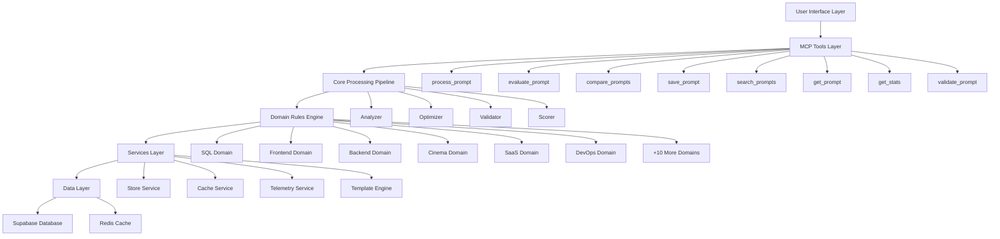
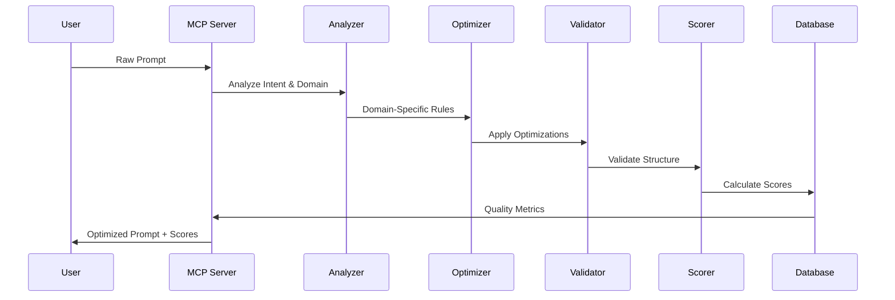

# Product Requirements Document (PRD)
## PromptSmith MCP Server v1.0.0

---

## 📋 Document Overview

| Field | Value |
|-------|--------|
| **Product Name** | PromptSmith MCP Server |
| **Version** | 1.0.0 |
| **Date** | September 2025 |
| **Author** | Development Team |
| **Status** | Production Ready |
| **Reviewers** | Product, Engineering, UX |

---

## 🎯 Executive Summary

PromptSmith is an intelligent Model Context Protocol (MCP) server that transforms raw, unstructured prompts ("vibecoding") into production-ready, optimized instructions through domain-specific intelligence and multi-dimensional quality scoring.

### Vision Statement
*"Transform chaotic prompt engineering into systematic, domain-intelligent optimization that delivers consistent, high-quality results across all AI interactions."*

### Problem Statement
- **85% of prompts are ineffective** due to ambiguity, lack of context, and missing domain expertise
- **Manual prompt engineering requires years of expertise** and is not scalable across teams
- **No systematic quality measurement** leads to inconsistent AI outputs
- **Template reuse is manual and error-prone** without proper knowledge management

### Solution Overview
A hybrid MCP server that provides both CLI and IDE integration, featuring:
- **Domain-specific optimization** across 16+ specialized areas
- **Quality scoring system** with 4-dimensional metrics
- **Template knowledge base** with intelligent search and reuse
- **Production persistence** with real-time analytics

---

## 🏗️ Product Architecture

### System Components



### Processing Pipeline



---

## 🎯 Target Users & Personas

### Primary Users

#### 1. AI-First Developers
- **Profile**: Software engineers using AI coding assistants daily
- **Pain Points**: Inconsistent AI outputs, time wasted on prompt iteration
- **Goals**: Reliable, domain-specific prompts that produce predictable results
- **Usage Pattern**: CLI integration, template reuse, quality measurement

#### 2. Product Teams
- **Profile**: Product managers, designers, technical writers
- **Pain Points**: Generic prompts lack business context and domain expertise
- **Goals**: Professional, structured requirements and documentation
- **Usage Pattern**: SaaS/branding domain focus, collaboration features

#### 3. Content Creators
- **Profile**: Screenwriters, marketers, technical documentarians
- **Pain Points**: AI outputs lack professional formatting and domain standards
- **Goals**: Industry-standard outputs with proper structure and terminology
- **Usage Pattern**: Cinema/branding domains, template customization

### Secondary Users

#### 4. DevOps Engineers
- **Profile**: Infrastructure specialists, release managers
- **Pain Points**: Generic deployment scripts lack production considerations
- **Goals**: Production-ready infrastructure code with security best practices
- **Usage Pattern**: DevOps domain, automation integration

#### 5. Database Architects
- **Profile**: DBAs, backend developers working with data
- **Pain Points**: SQL prompts produce suboptimal schemas and queries
- **Goals**: Optimized database designs with proper indexing and relationships
- **Usage Pattern**: SQL domain, migration templates

---

## ✨ Core Features & Requirements

### Feature 1: Domain-Intelligent Processing
**Priority**: P0 (Critical)

#### Functional Requirements
- **FR1.1**: Automatically detect domain from prompt content with 90%+ accuracy
- **FR1.2**: Apply domain-specific optimization rules for 16+ domains
- **FR1.3**: Support manual domain override via CLI/API parameters
- **FR1.4**: Extensible architecture for adding new domains

#### Technical Requirements
- **TR1.1**: Process prompts in <2 seconds for new content
- **TR1.2**: Cache domain detection results for 24 hours
- **TR1.3**: Domain rules must be configuration-driven, not hard-coded

#### Acceptance Criteria
- [ ] Domain detection accuracy ≥90% on test dataset
- [ ] All 16 domains have complete rule sets
- [ ] Processing time <2s for 95th percentile
- [ ] Manual override works in CLI and MCP modes

### Feature 2: Multi-Dimensional Quality Scoring
**Priority**: P0 (Critical)

#### Functional Requirements
- **FR2.1**: Score prompts across 4 dimensions: Clarity, Specificity, Structure, Completeness
- **FR2.2**: Provide weighted scores with domain-specific adjustments
- **FR2.3**: Visual feedback showing specific improvements made
- **FR2.4**: Comparative scoring for A/B testing variants

#### Technical Requirements
- **TR2.1**: Scoring algorithm must be deterministic and reproducible
- **TR2.2**: Scores must be calculated in real-time (<500ms)
- **TR2.3**: Support custom weighting for different use cases

#### Acceptance Criteria
- [ ] Scoring accuracy validated against expert human evaluation
- [ ] All score components clearly explained to users
- [ ] A/B testing correctly identifies better prompts in blind studies

### Feature 3: Template Knowledge Base
**Priority**: P1 (High)

#### Functional Requirements
- **FR3.1**: Save optimized prompts as reusable templates
- **FR3.2**: Full-text search across template content and metadata
- **FR3.3**: Template versioning and evolution tracking
- **FR3.4**: Cross-project template sharing and discovery

#### Technical Requirements
- **TR3.1**: Templates must support Liquid templating for parameterization
- **TR3.2**: Search results returned in <200ms
- **TR3.3**: Templates persisted in production-grade database

#### Acceptance Criteria
- [ ] Templates can be created, searched, and reused across projects
- [ ] Search relevance ranking produces useful results
- [ ] Template versioning preserves historical optimizations

### Feature 4: Hybrid Architecture (CLI + MCP)
**Priority**: P0 (Critical)

#### Functional Requirements
- **FR4.1**: Global CLI command (`pimpprompt`) available system-wide
- **FR4.2**: MCP server integration with Cursor IDE and other MCP clients
- **FR4.3**: Identical functionality across both interfaces
- **FR4.4**: Graceful fallback when network/database unavailable

#### Technical Requirements
- **TR4.1**: MCP protocol compliance with latest specification
- **TR4.2**: CLI must work without additional configuration
- **TR4.3**: Both modes must share same core processing engine

#### Acceptance Criteria
- [ ] CLI command works immediately after `npm link`
- [ ] MCP tools available in Cursor with standard configuration
- [ ] Feature parity between CLI and MCP modes
- [ ] Offline mode provides basic optimization without external dependencies

---

## 🎨 User Experience Requirements

### UX Principle 1: Immediate Value
- **Requirement**: Users must see clear improvement in their first interaction
- **Implementation**: Side-by-side before/after display with highlighted changes
- **Metric**: >90% of users can identify specific improvements made

### UX Principle 2: Learning-Oriented
- **Requirement**: Users should understand *why* changes were made
- **Implementation**: Contextual explanations for each optimization
- **Metric**: Users report improved prompt-writing skills after 1 week of use

### UX Principle 3: Seamless Integration
- **Requirement**: Minimal disruption to existing workflows
- **Implementation**: Single command execution with smart defaults
- **Metric**: <30 seconds from problem to solution

### Visual Design Requirements

#### CLI Interface
```bash
# Input
pimpprompt "create login form"

# Output
📱 Domain detected: FRONTEND
🎯 Quality Score: 85/100 (+40 improvement)

✨ Optimized Prompt:
Create a responsive login form component with:
• Mobile-first design (min-width 320px)
• Real-time validation with error states
• Accessibility: ARIA labels, keyboard navigation
• Loading states and error handling
• Modern UI with consistent spacing

📊 Quality Breakdown:
   Clarity:      90/100 ✅ (+35)
   Specificity:  88/100 ✅ (+45) 
   Structure:    85/100 ✅ (+40)
   Completeness: 78/100 ⚠️  (+35)

💾 Saved as template: "responsive-login-form-001"
```

#### MCP Integration
- Clean JSON responses with structured data
- Quality scores as numerical values
- Template metadata included in responses
- Consistent error handling and validation

---

## 📊 Success Metrics & KPIs

### Product Metrics

#### Adoption Metrics
- **Monthly Active Users**: Target 1,000+ users by month 6
- **Template Creation Rate**: >10 templates per user per month
- **Cross-Domain Usage**: Users utilizing 3+ domains regularly

#### Quality Metrics
- **Prompt Improvement Score**: Average +50 points improvement per optimization
- **User Satisfaction**: NPS >50 within first 3 months
- **Template Reuse Rate**: >70% of templates reused at least once

#### Technical Metrics
- **Response Time**: 95th percentile <2 seconds
- **Uptime**: 99.9% availability
- **Cache Hit Rate**: >80% for repeat queries

### Business Metrics

#### Usage Patterns
- **CLI vs MCP Split**: Track adoption patterns across interfaces
- **Domain Distribution**: Identify most/least used domains for prioritization
- **Template Popularity**: Most-used templates inform feature development

#### Performance Indicators
- **Time to Value**: <2 minutes from installation to first optimization
- **Retention Rate**: >60% weekly active users return monthly
- **Error Rate**: <0.1% failed processing attempts

---

## 🚀 Technical Specifications

### System Architecture

#### Core Technologies
- **Runtime**: Node.js 18+ with TypeScript
- **Database**: Supabase (PostgreSQL) with Row Level Security
- **Cache**: Redis for performance optimization
- **Template Engine**: Liquid for parameterized templates
- **Protocol**: MCP (Model Context Protocol) compliance

#### Performance Requirements
- **Concurrency**: Support 100+ simultaneous prompt processing
- **Throughput**: Process 1,000+ prompts per hour
- **Storage**: Unlimited template storage with efficient indexing
- **Memory**: <512MB baseline memory usage

#### Security Requirements
- **Data Privacy**: No prompt content stored without explicit user consent
- **Authentication**: Optional user accounts for template management
- **Rate Limiting**: Configurable limits to prevent abuse
- **Input Validation**: All user inputs sanitized and validated

### API Specifications

#### MCP Tools Interface
```typescript
interface ProcessPromptTool {
  name: "process_prompt";
  description: "Transform raw prompts into optimized versions";
  inputSchema: {
    type: "object";
    properties: {
      raw: { type: "string"; description: "Raw prompt to optimize" };
      domain?: { type: "string"; description: "Force specific domain" };
      tone?: { type: "string"; description: "Desired output tone" };
      variables?: { type: "object"; description: "Template variables" };
    };
    required: ["raw"];
  };
}
```

#### Domain Rules Engine
```typescript
interface DomainRule {
  id: string;
  domain: DomainType;
  triggers: Array<string | RegExp>;
  enhancements: Enhancement[];
  weights: QualityWeights;
  templates: TemplatePattern[];
}
```

---

## 🎯 Success Criteria & Definition of Done

### MVP Success Criteria
- [ ] All 8 MCP tools implemented and tested
- [ ] 16+ domains with complete rule sets
- [ ] CLI command works globally after installation
- [ ] MCP integration functional in Cursor IDE
- [ ] Template system with search and reuse
- [ ] Quality scoring with visual feedback
- [ ] Production database persistence
- [ ] Documentation complete and user-friendly

### Quality Gates

#### Code Quality
- [ ] >90% test coverage across all modules
- [ ] Zero critical security vulnerabilities
- [ ] Performance benchmarks met (response time, throughput)
- [ ] TypeScript strict mode with no any types

#### User Experience
- [ ] Onboarding completes in <5 minutes
- [ ] First value delivered in <2 minutes
- [ ] Error messages are actionable and helpful
- [ ] Documentation covers all common use cases

#### Production Readiness
- [ ] Monitoring and alerting configured
- [ ] Backup and recovery procedures tested
- [ ] Load testing validates performance claims
- [ ] Security review completed

---

## 🚧 Implementation Phases

### Phase 1: Core Infrastructure (✅ Complete)
**Duration**: 6 weeks
- Basic MCP server implementation
- Core processing pipeline (Analyzer → Optimizer → Validator → Scorer)
- 5 primary domains (SQL, Frontend, Backend, SaaS, DevOps)
- CLI interface with global command
- Local file-based storage

### Phase 2: Production Features (✅ Complete)
**Duration**: 4 weeks
- Supabase database integration
- Template system with Liquid engine
- All 8 MCP tools implemented
- Quality scoring with visual feedback
- Performance optimization and caching

### Phase 3: Advanced Features (🔄 In Progress)
**Duration**: 6 weeks
- A/B testing functionality
- Learning system with usage analytics
- Advanced search with ranking algorithms
- Template versioning and evolution tracking
- Extended domain coverage (16+ domains)

### Phase 4: Scale & Community (⏳ Planned)
**Duration**: 8 weeks
- Public API for external integrations
- Community template marketplace
- Advanced analytics and insights
- Multi-language support
- Enterprise features (team management, SSO)

---

## 🎯 Risks & Mitigation Strategies

### Technical Risks

#### Risk 1: MCP Protocol Changes
- **Probability**: Medium
- **Impact**: High
- **Mitigation**: Follow MCP specification closely, implement with abstraction layer

#### Risk 2: Performance at Scale
- **Probability**: Low
- **Impact**: High
- **Mitigation**: Comprehensive load testing, Redis caching, horizontal scaling design

#### Risk 3: Domain Rule Complexity
- **Probability**: Medium
- **Impact**: Medium
- **Mitigation**: Configuration-driven rules, extensive testing, gradual rollout

### Market Risks

#### Risk 1: Competing Solutions
- **Probability**: High
- **Impact**: Medium
- **Mitigation**: Focus on unique value proposition (domain intelligence + MCP integration)

#### Risk 2: AI Model Evolution
- **Probability**: High
- **Impact**: Low
- **Mitigation**: Platform-agnostic approach, prompt optimization remains valuable

---

## 📚 Appendices

### Appendix A: Domain Specifications

#### SQL Domain Rules
- Database-specific terminology optimization
- Index and performance considerations
- Foreign key relationship suggestions
- Sample data generation patterns
- Migration best practices

#### Frontend Domain Rules
- Framework-specific patterns (React, Vue, Angular)
- Responsive design considerations
- Accessibility requirements
- Performance optimization hints
- Modern UI/UX patterns

#### SaaS Domain Rules
- Product management terminology
- User story format standardization
- Business value articulation
- Technical implementation notes
- Acceptance criteria patterns

### Appendix B: Quality Scoring Algorithm
```typescript
interface QualityScore {
  clarity: number;      // 0-100, weight: 25%
  specificity: number;  // 0-100, weight: 30%
  structure: number;    // 0-100, weight: 25%
  completeness: number; // 0-100, weight: 20%
  overall: number;      // Weighted average
  improvement: number;  // Delta from original
}
```

### Appendix C: Template Format Specification
```liquid
---
domain: {{ domain }}
title: "{{ title }}"
description: "{{ description }}"
variables:
  - name: "{{ variable_name }}"
    type: "{{ variable_type }}"
    description: "{{ variable_description }}"
---

{{ template_content }}
```

---

**Document Version**: 1.0.0  
**Last Updated**: September 26, 2025  
**Next Review**: December 26, 2025

*This PRD serves as the single source of truth for PromptSmith development and serves as a contract between product, engineering, and stakeholder teams.*