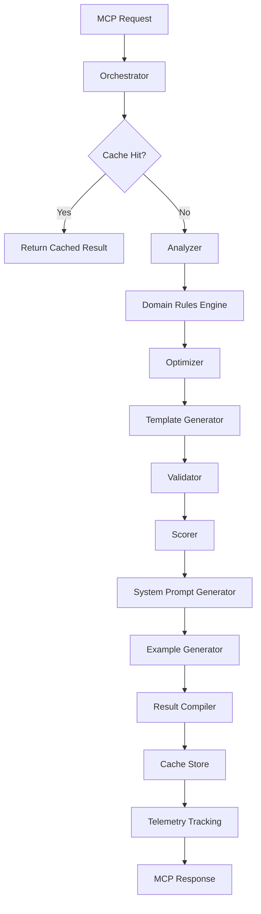

# PromptSmith MCP Architecture

Comprehensive guide to the technical architecture, system design, and implementation details of PromptSmith MCP Server.

## Table of Contents

- [System Overview](#system-overview)
- [Architecture Layers](#architecture-layers)
- [Data Flow](#data-flow)
- [Core Components](#core-components)
- [Domain Rules Engine](#domain-rules-engine)
- [Database Schema](#database-schema)
- [Caching Strategy](#caching-strategy)
- [Quality Scoring Algorithm](#quality-scoring-algorithm)
- [Template System](#template-system)
- [Security & Authentication](#security--authentication)
- [Performance Optimization](#performance-optimization)
- [Scalability Considerations](#scalability-considerations)

---

## System Overview

PromptSmith follows a modular, layered architecture designed for performance, maintainability, and extensibility. The system transforms raw prompts through a sophisticated pipeline of analysis, optimization, validation, and scoring.

### High-Level Architecture

```
┌─────────────────────────────────────────────────────────────────┐
│                    Client Applications                          │
│               (Cursor IDE, CLIs, Web UIs)                      │
└─────────────────────┬───────────────────────────────────────────┘
                      │ MCP Protocol (JSON-RPC over stdio)
┌─────────────────────▼───────────────────────────────────────────┐
│                 MCP Server Layer                               │
│  ┌─────────────┬─────────────┬─────────────┬─────────────┐    │
│  │ process     │ evaluate    │ compare     │ save        │    │
│  │ validate    │ search      │ get_prompt  │ get_stats   │    │
│  └─────────────┴─────────────┴─────────────┴─────────────┘    │
└─────────────────────┬───────────────────────────────────────────┘
                      │ Internal API Calls
┌─────────────────────▼───────────────────────────────────────────┐
│               Orchestration Layer                              │
│              PromptOrchestrator                                │
└─────────┬─────┬─────┬─────┬─────┬─────┬─────┬─────────────────┘
          │     │     │     │     │     │     │
          ▼     ▼     ▼     ▼     ▼     ▼     ▼
┌─────────┐ ┌───┐ ┌───┐ ┌───┐ ┌───┐ ┌───┐ ┌─────────┐
│Analyzer │ │Opt│ │Val│ │Scr│ │Ref│ │Tmp│ │Services │
└─────────┘ └───┘ └───┘ └───┘ └───┘ └───┘ └─────────┘
     │       │     │     │     │     │         │
     └───────┼─────┼─────┼─────┼─────┼─────────┘
             │     │     │     │     │
┌────────────▼─────▼─────▼─────▼─────▼─────────────────────────────┐
│                   Domain Rules Engine                          │
│  ┌─────────┬─────────┬─────────┬─────────┬─────────┐          │
│  │   SQL   │ Branding│ Cinema  │  SaaS   │ DevOps  │          │
│  └─────────┴─────────┴─────────┴─────────┴─────────┘          │
└─────────────────────┬───────────────────────────────────────────┘
                      │ Data & Services Access
┌─────────────────────▼───────────────────────────────────────────┐
│                  Services Layer                                │
│  ┌─────────────┬─────────────┬─────────────┬─────────────┐    │
│  │ Store       │ Cache       │ Telemetry   │ Templates   │    │
│  │ (Supabase)  │ (Redis)     │ (Analytics) │ (Liquid)    │    │
│  └─────────────┴─────────────┴─────────────┴─────────────┘    │
└─────────────────────┬───────────────────────────────────────────┘
                      │ External Dependencies
┌─────────────────────▼───────────────────────────────────────────┐
│              External Infrastructure                           │
│  ┌─────────────┬─────────────┬─────────────┬─────────────┐    │
│  │ PostgreSQL  │ Redis       │ OpenAI      │ Monitoring  │    │
│  │ (Supabase)  │ Cache       │ (Optional)  │ Services    │    │
│  └─────────────┴─────────────┴─────────────┴─────────────┘    │
└─────────────────────────────────────────────────────────────────┘
```

### Key Design Principles

1. **Separation of Concerns**: Each layer has distinct responsibilities
2. **Modular Architecture**: Components are loosely coupled and independently testable
3. **Domain-Driven Design**: Business logic organized around prompt optimization domains
4. **Performance First**: Caching, async processing, and optimized algorithms
5. **Extensibility**: Plugin architecture for custom domains and rules
6. **Observability**: Comprehensive logging, metrics, and tracing

---

## Architecture Layers

### 1. MCP Server Layer

**Responsibility**: Protocol handling, request/response validation, error management

**Components**:
- **PromptSmithServer**: Main MCP server implementation
- **Tool Handlers**: Individual handlers for each of the 8 MCP tools
- **Schema Validation**: Input/output validation using Zod schemas
- **Error Handling**: Standardized error responses and logging

**Key Features**:
```typescript
// MCP Tool Registration
this.server.setRequestHandler(ListToolsRequestSchema, async () => {
  return { tools: [process_prompt, evaluate_prompt, ...] };
});

// Request handling with validation
this.server.setRequestHandler(CallToolRequestSchema, async (request) => {
  const { name, arguments: args } = request.params;
  return await this.routeToHandler(name, args);
});
```

### 2. Orchestration Layer

**Responsibility**: Coordinate complex processing workflows across multiple components

**Primary Component**: `PromptOrchestrator`

**Key Workflows**:
```typescript
class PromptOrchestrator {
  async process(input: ProcessInput): Promise<ProcessResult> {
    // 1. Cache check
    const cached = await this.cache.get(cacheKey);

    // 2. Analysis pipeline
    const analysis = await this.analyzer.analyze(input.raw);
    const refinement = await this.refiner.applyDomainRules(input.raw, input.domain, analysis);
    const optimization = await this.optimizer.optimize(refinement);

    // 3. Quality assessment
    const validation = await this.validator.validate(optimization.result, analysis);
    const score = await this.scorer.calculate(optimization.result, validation, analysis);

    // 4. Template and examples generation
    const template = await this.generateTemplate(optimization.result, input);
    const examples = await this.generateExamples(optimization.result, input, score);

    // 5. Result compilation and caching
    return this.compileResult(input, analysis, refinement, optimization, validation, score, template, examples);
  }
}
```

### 3. Core Processing Components

**Analyzer** (`PromptAnalyzer`):
- Natural language processing using `natural` library
- Complexity analysis and readability scoring
- Entity extraction and intent classification
- Domain hint detection

**Optimizer** (`PromptOptimizer`):
- Structure improvement algorithms
- Content enhancement based on domain rules
- Template variable identification
- Performance optimization

**Validator** (`PromptValidator`):
- Best practice validation
- Domain-specific rule compliance
- Error and warning generation
- Suggestion compilation

**Scorer** (`ScoreService`):
- Multi-dimensional quality assessment
- Domain-weighted scoring algorithms
- Comparative analysis capabilities
- Improvement tracking

### 4. Domain Rules Engine

**Architecture**:
```typescript
interface DomainRule {
  id: string;
  domain: PromptDomain;
  category: RuleCategory;
  pattern: RegExp | string;
  replacement: string | ((match: string) => string);
  priority: number;
  condition?: (analysis: AnalysisResult) => boolean;
}

class DomainRulesEngine {
  private rules: Map<PromptDomain, DomainRule[]> = new Map();

  async applyRules(prompt: string, domain: PromptDomain, analysis: AnalysisResult): Promise<RefinementResult> {
    const domainRules = this.rules.get(domain) || [];
    const applicableRules = domainRules
      .filter(rule => !rule.condition || rule.condition(analysis))
      .sort((a, b) => b.priority - a.priority);

    return this.processRules(prompt, applicableRules);
  }
}
```

### 5. Services Layer

**Store Service** (`StoreService`):
- Database operations using Supabase client
- Prompt CRUD operations
- Search and retrieval functionality
- Usage statistics tracking

**Cache Service** (`CacheService`):
- Redis-based caching layer
- Quality-dependent TTL strategies
- Cache invalidation policies
- Performance metrics

**Telemetry Service** (`TelemetryService`):
- Event tracking and analytics
- Performance monitoring
- Error reporting
- Usage pattern analysis

**Template Service** (`TemplateService`):
- Liquid template processing
- Variable substitution
- Template library management
- Dynamic template generation

---

## Data Flow

### Primary Processing Flow (process_prompt)



### Data State Transitions

1. **Raw Input**: Unstructured user prompt
2. **Analyzed**: Tokenized, POS-tagged, entity-extracted
3. **Domain-Enhanced**: Rules applied based on domain context
4. **Optimized**: Structure and content improvements
5. **Templated**: Variable placeholders and template structure
6. **Validated**: Error checking and best practice compliance
7. **Scored**: Quality metrics calculated
8. **Enriched**: System prompts and examples added
9. **Compiled**: Final result structure assembled

---

## Core Components

### PromptAnalyzer

**Purpose**: Comprehensive natural language analysis of input prompts

**Key Algorithms**:
```typescript
class PromptAnalyzer {
  async analyze(prompt: string): Promise<AnalysisResult> {
    return {
      tokens: await this.tokenizeAndPOS(prompt),
      entities: await this.extractEntities(prompt),
      intent: await this.classifyIntent(prompt),
      complexity: this.calculateComplexity(prompt),
      ambiguityScore: this.measureAmbiguity(prompt),
      hasVariables: this.detectVariables(prompt),
      language: this.detectLanguage(prompt),
      domainHints: this.extractDomainHints(prompt),
      sentimentScore: this.analyzeSentiment(prompt),
      readabilityScore: this.calculateReadability(prompt),
      technicalTerms: this.identifyTechnicalTerms(prompt)
    };
  }

  private calculateComplexity(prompt: string): number {
    const factors = {
      lengthFactor: Math.min(prompt.length / 500, 1),
      sentenceFactor: this.averageSentenceLength(prompt) / 20,
      vocabularyFactor: this.uniqueWords(prompt).length / this.totalWords(prompt).length,
      technicalFactor: this.technicalTermDensity(prompt)
    };

    return (factors.lengthFactor * 0.2 +
            factors.sentenceFactor * 0.3 +
            factors.vocabularyFactor * 0.3 +
            factors.technicalFactor * 0.2);
  }
}
```

### Domain Rules Engine

**SQL Domain Rules Example**:
```typescript
const sqlRules: DomainRule[] = [
  {
    id: 'sql_table_specificity',
    domain: PromptDomain.SQL,
    category: 'enhancement',
    pattern: /\b(table|tabla)\b/gi,
    replacement: (match) => 'well-structured database table',
    priority: 5,
    condition: (analysis) => analysis.complexity < 0.6
  },
  {
    id: 'sql_add_constraints',
    domain: PromptDomain.SQL,
    category: 'structure',
    pattern: /create\s+table/gi,
    replacement: '$& with appropriate constraints, indexes, and foreign key relationships',
    priority: 8
  }
];
```

**Branding Domain Rules Example**:
```typescript
const brandingRules: DomainRule[] = [
  {
    id: 'branding_audience_focus',
    domain: PromptDomain.BRANDING,
    category: 'enhancement',
    pattern: /marketing|copy|content/gi,
    replacement: 'targeted marketing content for [specific audience]',
    priority: 7,
    condition: (analysis) => !analysis.entities.find(e => e.label === 'AUDIENCE')
  }
];
```

### Quality Scoring System

**Multi-Dimensional Scoring**:
```typescript
interface ScoringWeights {
  domain: PromptDomain;
  weights: {
    clarity: number;
    specificity: number;
    structure: number;
    completeness: number;
  };
}

const domainWeights: Record<PromptDomain, ScoringWeights['weights']> = {
  [PromptDomain.SQL]: {
    clarity: 0.2,
    specificity: 0.4,  // High weight for technical precision
    structure: 0.25,
    completeness: 0.15
  },
  [PromptDomain.BRANDING]: {
    clarity: 0.35,     // High weight for clear communication
    specificity: 0.25,
    structure: 0.2,
    completeness: 0.2
  },
  [PromptDomain.CINE]: {
    clarity: 0.3,
    specificity: 0.2,
    structure: 0.4,    // High weight for screenplay structure
    completeness: 0.1
  }
};

class ScoreService {
  async calculate(prompt: string, validation: ValidationResult, analysis: AnalysisResult, domain: PromptDomain = PromptDomain.GENERAL): Promise<QualityScore> {
    const weights = domainWeights[domain];

    const rawScores = {
      clarity: this.assessClarity(prompt, analysis, validation),
      specificity: this.assessSpecificity(prompt, analysis, domain),
      structure: this.assessStructure(prompt, analysis),
      completeness: this.assessCompleteness(prompt, analysis, domain)
    };

    const overall = (
      rawScores.clarity * weights.clarity +
      rawScores.specificity * weights.specificity +
      rawScores.structure * weights.structure +
      rawScores.completeness * weights.completeness
    );

    return { ...rawScores, overall };
  }
}
```

---

## Database Schema

### Core Tables Architecture

The database schema follows a normalized design optimized for performance and scalability:

```sql
-- Core entity relationships
prompts (1) ←→ (N) prompt_evaluations
prompts (1) ←→ (N) prompt_examples
prompts (N) ←→ (1) prompt_templates
prompts (1) ←→ (N) user_feedback

-- Analytics and tracking
usage_analytics → prompts (optional FK)
user_sessions (1) ←→ (N) usage_analytics

-- Configuration
custom_rules (independent)
prompt_templates (independent)
```

### Key Design Decisions

1. **JSONB for Flexible Data**: Quality scores, metadata, and configuration stored as JSONB for flexibility
2. **Enum Types**: Domain, tone, and template types as PostgreSQL enums for data integrity
3. **Full-Text Search**: GIN indexes on combined prompt text for efficient searching
4. **Row-Level Security**: RLS policies for multi-tenant data isolation
5. **Audit Trail**: Comprehensive timestamp tracking and versioning

### Performance Optimizations

```sql
-- Composite indexes for common queries
CREATE INDEX idx_prompts_domain_quality ON prompts(domain, ((quality_score->>'overall')::DECIMAL) DESC);
CREATE INDEX idx_prompts_search_vector ON prompts USING GIN(to_tsvector('english', raw_prompt || ' ' || refined_prompt));

-- Partial indexes for filtered queries
CREATE INDEX idx_prompts_public_recent ON prompts(created_at DESC) WHERE is_public = true;

-- Function-based indexes for JSONB queries
CREATE INDEX idx_prompts_overall_score ON prompts(((quality_score->>'overall')::DECIMAL) DESC);
```

---

## Caching Strategy

### Multi-Level Caching Architecture

```typescript
interface CacheConfig {
  layers: {
    memory: LRUCache<string, any>;      // L1: In-memory cache
    redis: RedisClient;                  // L2: Distributed cache
    database: DatabaseClient;           // L3: Persistent storage
  };
  policies: {
    ttl: TTLPolicy;                     // Time-based expiration
    quality: QualityBasedPolicy;        // Quality-dependent TTL
    invalidation: InvalidationPolicy;   // Cache invalidation rules
  };
}

class CacheService {
  async get<T>(key: string): Promise<T | null> {
    // L1: Check memory cache
    const memoryResult = this.memoryCache.get(key);
    if (memoryResult) return memoryResult;

    // L2: Check Redis cache
    const redisResult = await this.redisClient.get(key);
    if (redisResult) {
      this.memoryCache.set(key, redisResult);
      return JSON.parse(redisResult);
    }

    return null;
  }

  async set<T>(key: string, value: T, ttl?: number): Promise<void> {
    const serialized = JSON.stringify(value);

    // Set in both caches
    this.memoryCache.set(key, value);
    await this.redisClient.setex(key, ttl || this.defaultTTL, serialized);
  }
}
```

### Cache Key Strategy

```typescript
class CacheKeyGenerator {
  generatePromptKey(input: ProcessInput): string {
    const normalized = {
      raw: input.raw.toLowerCase().trim(),
      domain: input.domain,
      tone: input.tone,
      context: input.context?.toLowerCase().trim(),
      variables: this.sortObject(input.variables)
    };

    return `prompt:${this.hash(normalized)}`;
  }

  generateSearchKey(params: SearchParams): string {
    const normalized = {
      query: params.query?.toLowerCase().trim(),
      domain: params.domain,
      tags: params.tags?.sort(),
      minScore: params.minScore,
      sortBy: params.sortBy
    };

    return `search:${this.hash(normalized)}:${params.limit}:${params.offset}`;
  }
}
```

### Quality-Based TTL

```typescript
function calculateTTL(score: QualityScore): number {
  const baseTTL = 3600; // 1 hour
  const qualityMultiplier = Math.max(0.5, score.overall);
  const maxTTL = 86400; // 24 hours

  return Math.min(baseTTL * qualityMultiplier * 2, maxTTL);
}
```

---

## Template System

### Liquid Template Engine Integration

```typescript
interface TemplateConfig {
  engine: LiquidEngine;
  variables: Record<string, any>;
  filters: CustomFilter[];
  tags: CustomTag[];
}

class TemplateService {
  private engine: Liquid;

  constructor() {
    this.engine = new Liquid({
      cache: true,
      strictFilters: false,
      strictVariables: false
    });

    this.registerCustomFilters();
    this.registerCustomTags();
  }

  async render(template: string, variables: Record<string, any>): Promise<string> {
    try {
      return await this.engine.parseAndRender(template, variables);
    } catch (error) {
      throw new TemplateRenderError(`Template rendering failed: ${error.message}`);
    }
  }

  private registerCustomFilters(): void {
    // Domain-specific filters
    this.engine.registerFilter('sql_format', (input: string) => {
      return this.formatSQLStatement(input);
    });

    this.engine.registerFilter('camel_case', (input: string) => {
      return input.replace(/[^a-zA-Z0-9]+(.)/g, (_, char) => char.toUpperCase());
    });
  }
}
```

### Template Types and Patterns

```typescript
enum TemplateType {
  BASIC = 'basic',
  CHAIN_OF_THOUGHT = 'chain-of-thought',
  FEW_SHOT = 'few-shot',
  ROLE_BASED = 'role-based',
  STEP_BY_STEP = 'step-by-step'
}

const templatePatterns: Record<TemplateType, string> = {
  [TemplateType.BASIC]: `
{{prompt_content}}

Requirements:

- {{requirement}}

`,

  [TemplateType.CHAIN_OF_THOUGHT]: `
Task: {{task_description}}

Let's think through this step by step:

1. First, I need to {{first_step}}
2. Then, I should {{second_step}}
3. Finally, I will {{final_step}}

{{prompt_content}}
`,

  [TemplateType.FEW_SHOT]: `
Here are some examples:


Input: {{example.input}}
Output: {{example.output}}


Now, please apply the same pattern to:
{{prompt_content}}
`
};
```

---

## Security & Authentication

### Row-Level Security (RLS)

```sql
-- Enable RLS on all user-data tables
ALTER TABLE prompts ENABLE ROW LEVEL SECURITY;

-- Policy for public prompts
CREATE POLICY "Public prompts viewable by all" ON prompts
  FOR SELECT USING (is_public = true);

-- Policy for user's own prompts
CREATE POLICY "Users can manage own prompts" ON prompts
  FOR ALL USING (author_id = current_setting('app.user_id', true));

-- Policy for prompt evaluations
CREATE POLICY "Users can evaluate accessible prompts" ON prompt_evaluations
  FOR INSERT WITH CHECK (
    EXISTS (
      SELECT 1 FROM prompts
      WHERE prompts.id = prompt_evaluations.prompt_id
      AND (prompts.is_public = true OR prompts.author_id = current_setting('app.user_id', true))
    )
  );
```

### Input Validation and Sanitization

```typescript
class SecurityService {
  validateInput(input: any, schema: ZodSchema): ValidationResult {
    try {
      return { valid: true, data: schema.parse(input) };
    } catch (error) {
      return { valid: false, errors: this.parseZodErrors(error) };
    }
  }

  sanitizePrompt(prompt: string): string {
    // Remove potential injection attempts
    return prompt
      .replace(/[<>]/g, '') // Basic XSS prevention
      .replace(/\b(SELECT|INSERT|UPDATE|DELETE|DROP|CREATE|ALTER)\b/gi, '') // SQL injection prevention
      .trim()
      .slice(0, 10000); // Length limit
  }

  checkRateLimit(userId: string, operation: string): Promise<boolean> {
    const key = `rate_limit:${userId}:${operation}`;
    return this.redis.checkLimit(key, this.getRateLimit(operation));
  }
}
```

---

## Performance Optimization

### Async Processing Pipeline

```typescript
class ProcessingPipeline {
  async processPrompt(input: ProcessInput): Promise<ProcessResult> {
    // Run independent operations in parallel
    const [cacheResult, analysis] = await Promise.all([
      this.cache.get(this.generateCacheKey(input)),
      this.analyzer.analyze(input.raw)
    ]);

    if (cacheResult) return cacheResult;

    // Sequential operations that depend on analysis
    const refinement = await this.refiner.applyDomainRules(input.raw, input.domain, analysis);

    // Parallel post-processing
    const [optimization, validation, systemPrompt] = await Promise.all([
      this.optimizer.optimize(refinement),
      this.validator.validate(refinement.refined, analysis),
      this.refiner.generateSystemPrompt(input.domain, analysis)
    ]);

    // Final scoring and compilation
    const score = await this.scorer.calculate(optimization.optimized, validation, analysis);

    return this.compileResult(input, analysis, optimization, validation, score, systemPrompt);
  }
}
```

### Database Query Optimization

```typescript
class OptimizedQueries {
  async searchPrompts(params: SearchParams): Promise<SearchResult[]> {
    // Use prepared statements for better performance
    const query = `
      SELECT
        p.id, p.name, p.domain, p.tags, p.description,
        p.refined_prompt, p.quality_score, p.usage_count,
        p.created_at, p.updated_at,
        ts_rank(search_vector, plainto_tsquery($1)) as relevance_score
      FROM prompts p
      WHERE
        ($2::prompt_domain IS NULL OR p.domain = $2)
        AND ($3::TEXT[] IS NULL OR p.tags && $3)
        AND ($4::DECIMAL IS NULL OR (p.quality_score->>'overall')::DECIMAL >= $4)
        AND ($5::BOOLEAN IS NULL OR p.is_public = $5)
        AND ($1::TEXT IS NULL OR search_vector @@ plainto_tsquery($1))
      ORDER BY
        CASE WHEN $6 = 'relevance' THEN ts_rank(search_vector, plainto_tsquery($1)) END DESC,
        CASE WHEN $6 = 'score' THEN (p.quality_score->>'overall')::DECIMAL END DESC,
        CASE WHEN $6 = 'created' THEN p.created_at END DESC,
        CASE WHEN $6 = 'updated' THEN p.updated_at END DESC
      LIMIT $7 OFFSET $8
    `;

    return await this.db.query(query, [
      params.query,
      params.domain,
      params.tags,
      params.minScore,
      params.isPublic,
      params.sortBy,
      params.limit,
      params.offset
    ]);
  }
}
```

### Memory Management

```typescript
class MemoryManager {
  private memoryCache = new LRU<string, any>({
    maxSize: 100 * 1024 * 1024, // 100MB limit
    sizeCalculation: (value) => JSON.stringify(value).length,
    dispose: (value, key) => {
      this.telemetry.track('cache_eviction', { key, size: this.getSize(value) });
    }
  });

  async cleanupMemory(): Promise<void> {
    if (process.memoryUsage().heapUsed > this.memoryThreshold) {
      this.memoryCache.clear();
      global.gc && global.gc(); // Force garbage collection if available

      this.telemetry.track('memory_cleanup', {
        heapUsed: process.memoryUsage().heapUsed,
        heapTotal: process.memoryUsage().heapTotal
      });
    }
  }
}
```

---

## Scalability Considerations

### Horizontal Scaling Architecture

```
┌─────────────────────────────────────────────────────────────┐
│                    Load Balancer                           │
│                  (NGINX/HAProxy)                           │
└─────────────────────┬───────────────────────────────────────┘
                      │
          ┌───────────┼───────────┐
          │           │           │
          ▼           ▼           ▼
    ┌─────────┐ ┌─────────┐ ┌─────────┐
    │ MCP     │ │ MCP     │ │ MCP     │
    │ Server  │ │ Server  │ │ Server  │
    │ Node 1  │ │ Node 2  │ │ Node 3  │
    └─────────┘ └─────────┘ └─────────┘
          │           │           │
          └───────────┼───────────┘
                      │
    ┌─────────────────────────────────────────────────────────┐
    │                Shared Services                          │
    │  ┌─────────────┬─────────────┬─────────────┐          │
    │  │ Redis       │ Supabase    │ Monitoring  │          │
    │  │ (Cache)     │ (Database)  │ (Telemetry) │          │
    │  └─────────────┴─────────────┴─────────────┘          │
    └─────────────────────────────────────────────────────────┘
```

### Auto-Scaling Configuration

```typescript
interface ScalingConfig {
  metrics: {
    cpuThreshold: number;        // Scale when CPU > 70%
    memoryThreshold: number;     // Scale when memory > 80%
    requestRate: number;         // Scale when requests > 1000/min
    queueLength: number;         // Scale when queue > 50 items
  };

  scaling: {
    minInstances: number;        // Minimum 2 instances
    maxInstances: number;        // Maximum 10 instances
    scaleUpCooldown: number;     // 300 seconds between scale-ups
    scaleDownCooldown: number;   // 600 seconds between scale-downs
  };

  healthCheck: {
    interval: number;            // Health check every 30 seconds
    timeout: number;             // 10 second timeout
    retries: number;             // 3 retries before marking unhealthy
    endpoint: string;            // "/health" endpoint
  };
}

class AutoScaler {
  async shouldScale(metrics: SystemMetrics): Promise<ScalingDecision> {
    const factors = {
      cpu: metrics.cpuUsage > this.config.metrics.cpuThreshold,
      memory: metrics.memoryUsage > this.config.metrics.memoryThreshold,
      requests: metrics.requestRate > this.config.metrics.requestRate,
      queue: metrics.queueLength > this.config.metrics.queueLength
    };

    const scaleUpFactors = Object.values(factors).filter(Boolean).length;

    if (scaleUpFactors >= 2) {
      return { action: 'scale_up', reason: this.getScalingReason(factors) };
    } else if (scaleUpFactors === 0 && this.canScaleDown(metrics)) {
      return { action: 'scale_down', reason: 'low_resource_usage' };
    }

    return { action: 'no_change', reason: 'within_thresholds' };
  }
}
```

### Database Scaling Strategy

```typescript
// Read replicas for query distribution
class DatabaseScaler {
  private connections = {
    write: this.createConnection(process.env.DATABASE_WRITE_URL),
    read: [
      this.createConnection(process.env.DATABASE_READ1_URL),
      this.createConnection(process.env.DATABASE_READ2_URL),
      this.createConnection(process.env.DATABASE_READ3_URL)
    ]
  };

  async query(sql: string, params: any[], options: { readonly?: boolean } = {}): Promise<any> {
    const connection = options.readonly
      ? this.getReadConnection()
      : this.connections.write;

    return await connection.query(sql, params);
  }

  private getReadConnection() {
    // Round-robin load balancing across read replicas
    const index = this.readConnectionIndex++ % this.connections.read.length;
    return this.connections.read[index];
  }
}

// Partitioning strategy for large tables
const partitioningStrategy = {
  prompts: 'RANGE PARTITION BY created_at',  // Monthly partitions
  usage_analytics: 'RANGE PARTITION BY created_at',  // Weekly partitions
  prompt_evaluations: 'HASH PARTITION BY prompt_id'  // Hash partitioning
};
```

This comprehensive architecture supports the system's requirements for performance, scalability, and maintainability while providing a solid foundation for future enhancements and domain expansions.